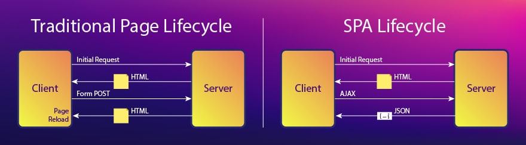

<style>
  pre {
    background: #1E1E1E !important;
  }
</style>

# **React** Training
 > Day One

---

# **Aashish Manandhar** (acesmndr)
> Senior Software Engineer
> **CloudFactory**

---

# What you'll learn **hopefully** 😅
* Introduction to React
* Props to the state of React
* React LifeCycle
* Understanding the context and a few more hooks
* Handling Async with React
* Closing Thoughts / Miscellaneous

---

# Introduction to **React**


---

# Let's start with **Frontend** 🎨

- HTML
- CSS
- JavaScript

---

# **jQuery**

- Small, fast and feature rich library

---

# What is React?

* A JavaScript **Library** for developing interfaces
* Can be used as a base for developing Single Page Applications (SPA) or even mobile applications

---

# Library not a Framework

* It deals with the view.
* Lets you choose the rest of your front-end architecture.
* By just adding a few libraries, you can build a complete framework

---

# History

* Created by Jordan Walke, a software engineer at **Facebook**
* Currently in version `17.0.2`

---

# Why React.js?

* Maintainable, Manageable and Reusable Code
* Open Source
* Big Community and Huge ecosystem
* Easy to learn

---

# Why people love React.js?

* Components
* Virtual DOM
* Performance
* Simplicity
* Reusability

---


---
<!-- _backgroundColor: white -->


---

# Simple React Component
```jsx
class HelloMessage extends React.Component {
  render() {
    return (
      <div>
        Hello Aces
      </div>
    );
  }
}
```

---

# Simple React Component

```jsx
const HelloMessage = () => {
  return (
    <div>
      Hello Aces
    </div>
  );
};
```

---

# What is JSX

* Embed HTML in Javascript
* Extension for files to store React elements
* Instead of putting markup and logic in separate files, React separates concerns using loosely coupled units called components contaning both. 

---
# JSX

```jsx
  const name = 'Aashish';
  const element = <h1>Hello, {name}</h1>;
```

---
# JSX

```jsx
  function formatName(user) {
    return user.firstName + ' ' + user.lastName;
  }

  const user = {
    firstName: 'Ram',
    lastName: 'Bahadur'
  };

  const element = (
    <h1>
      Hello, {formatName(user)}!
    </h1>
  );
```

---

# JSX
```jsx
const element = (<div className="awesome">Hello aces</div>);
// babel compiles it to
const element = React.createElement('div', { className: 'awesome' }, 'Hello aces');
// which essentially is
const element = React.createElement(
  'div',
  {className: 'awesome'},
  'Hello aces'
);

```

---

# Single Page Application

Dynamically **rewrites** the current web page with new data from the server instead of **loading entire new pages**.


---

# DOM (Document Object Model)

* Represents the document as nodes and objects
* Initially it was tightly intertwined with JS, but they evolved as separate entities
* Isn't a programming language but without it JS can't work with webpages.

---

# Document Object Model (DOM)


---

# Virtual DOM

* A programming concept where a `virtual` representation of the UI is kept in memory and synced with the `real` DOM by a library such as `ReactDOM`
* `Reconciliation`: The algorithm React uses to diff one tree with another to determine which parts need to be changed.
* `Fiber` is the new reconciliation engine in `React 16`

---
<!-- _backgroundColor: white -->


---
# **Reconciliation** vs **Rendering**

* `Reconciler` does the work of computing which parts of a tree have changed
* `Renderer` then uses that information to actually update the rendered app.
* This separation means that `React DOM` and `React Native` can use their own renderers while sharing the same `reconciler`, provided by React core.

---

# **React**DOM

* DOM specific methods to enable an efficient way of managing DOM elements of the webpage
* Methods such as `render()`, `hydrate()`, `findDOMNode()`

---

# **React**DOM

```jsx
  import ReactDOM from 'react-dom';
  const element = (<div className="awesome">Hello aces</div>);

  ReactDOM.render(
    element,
    document.getElementById('root')
  );
```

---
<!-- _backgroundColor: white -->


---

# **Node**.js
> Runs `JS` directly in a `computer process` itself instead of in a browser. Node can, therefore, be used to write `server-side applications` with access to the operating system, file system, and everything else required to build `fully-functional applications.`

---

# **Home**work 🏡

### Install **IDE**
* Visual Studio Code  `Recommended`

---

# **Home**work 🏡

### Install **Node**
> https://nodejs.org/en/download/

---

### Create a **React Application**

* Open Terminal / Command Prompt
* Ensure node and npm are installed by running following commands to check their installed versions
  ```sh
  node -v
  npm -v
  ```
  Make sure `node` >= `10.16` and `npm` >= `5.6`
* Create a new react app
  ```sh
  npx create-react-app my-app
  ```
* Run the react app
  ```sh
  cd my-app
  npm start
  ```