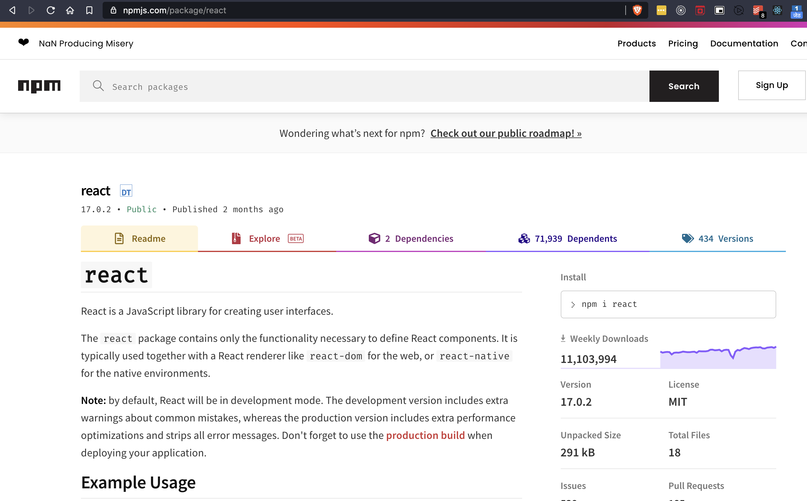

<style>
  pre {
    background: #1E1E1E !important;
  }
</style>

# **React** Training
 > Day Two

---

# **Props** to the **State** of React

---

# npm 📦
> Node Package Manager

---

# npm 📦
* The **free npm registry** has become the center of **JavaScript** code sharing
* The **largest** software registry ( > 1M packages) in the world.
* Relied upon by more than 11 million developers worldwide + possibly **you**.

---



---

# Initiating project

```sh
  npm init
  git init
```

---

# Installing a package

```sh
 npm i react
 # or
 yarn add react
 # or
 npm install -g react # Not recommended
 ```

---

# Create a New React App

> Use an **integrated toolchain** for the best user and developer experience.

---

# Toolchain

* `Package Manager`: npm, yarn
* `Bundler`: webpack, parcel
* `Compiler`: babel

---

# Recommended Toolchains 🛠

* If you’re learning React or creating a new single-page app, use Create React App.
* If you’re building a server-rendered website with Node.js, try Next.js.
* If you’re building a static content-oriented website, try Gatsby.

---

# Without Toolchain

> Add React as a plain `<script>` tag on an HTML page, optionally with `JSX`.

---

# Why you need a Toolchain ?

* Scaling to many files and components.
* Using third-party libraries from npm.
* Detecting common mistakes early.
* Live-editing CSS and JS in development.
* Optimizing the output for production.

---

# Create React App
* Sets up your development environment so that you can use the latest JavaScript features
* Optimizes app for production
* Doesn't handle backend logic or databases
* Comes with `webpack` and `babel`

---

# npx

> It wasn't a typo. It's a package runner tool (> npm **v5.2+**)

```sh
 npx create-react-app aces-app
```

---

# **Prop**ertie**s** of a Component

> Conceptually **Components** are like JavaScript functions that accept arbitrary inputs called `props` and return `React elements`.

---

# Using Props

```jsx
class Welcome extends React.Component {
  render() {
    return <h1>Hello, {this.props.name}</h1>;
  }
}
```

```jsx
function Welcome(props) {
  return <h1>Hello, {props.name}</h1>;
}
```

---

# Composing and Extracting Components

```jsx
function App() {
  return (
    <div>
      <Welcome name="Sara" />
      <Welcome name="Cahal" />
      <Welcome name="Edite" />
    </div>
  );
}

ReactDOM.render(
  <App />,
  document.getElementById('root')
);
```

---

# Handling Events

* Use camelCase
* Pass in function as opposed to string

```html
  <!-- In HTML -->
  <button onclick="activateLasers()">Activate Lasers</button>
```

```html
  <!-- In React -->
  <button onClick={activateLasers}>Activate Lasers</button>
```

---

# Stateful Component (ClassBased)
```jsx
class Button extends React.Component {
  constructor(props) {
    super(props);
    this.state = {
      count: 0
    };
  }
  render() {
    return (
      <button onClick={() => this.setState({ count: this.state.count + 1 })}>
        {this.state.count}
      </button>
    )
  }
}
```

---
# Stateful Component (Functional)
```jsx
const Button = () => {
  const [count, setCount] = useState(0);
  return (
    <button onClick={() => setCount(count + 1)}>{count}</button>
  );
}
```

---
# Does this work?
```jsx
const Button = () => {
  const count = 0;
  return (
    <button onClick={() => (count++)}>{count}</button>
  );
}
```

---
# QUIZ
```js
let count = 0;
console.log(count++);
console.log(++count);
```

---

# Unidirectional Data Flow

* Data Flows Down ⤵️
* Neither a parent nor a child component knows if a certain component is stateful or stateless 👨🏻‍🦯
* State is local or encapsulated 🔒
* If you imagine a component tree as a waterfall of props, each component's state is like an additional water source that could join it at an arbitrary point but also flows down 🌊

---

# Conditional Rendering

```jsx
  const Homepage = (props) => {
    if (props.isLoggedIn) {
      return <Dashboard />
    }
    return <LoginPage />
  }
```

---

# Inline Conditional Rendering / Prevent Rendering

```jsx
  const LoginMessage = (props) => {
    return (
      <div>
        The user is <b>{props.isLoggedIn ? 'currently' : 'not'}</b> logged in.
      </div>
    );
  }
```
